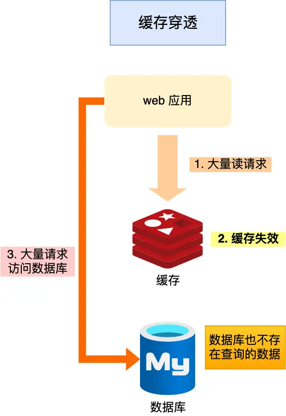
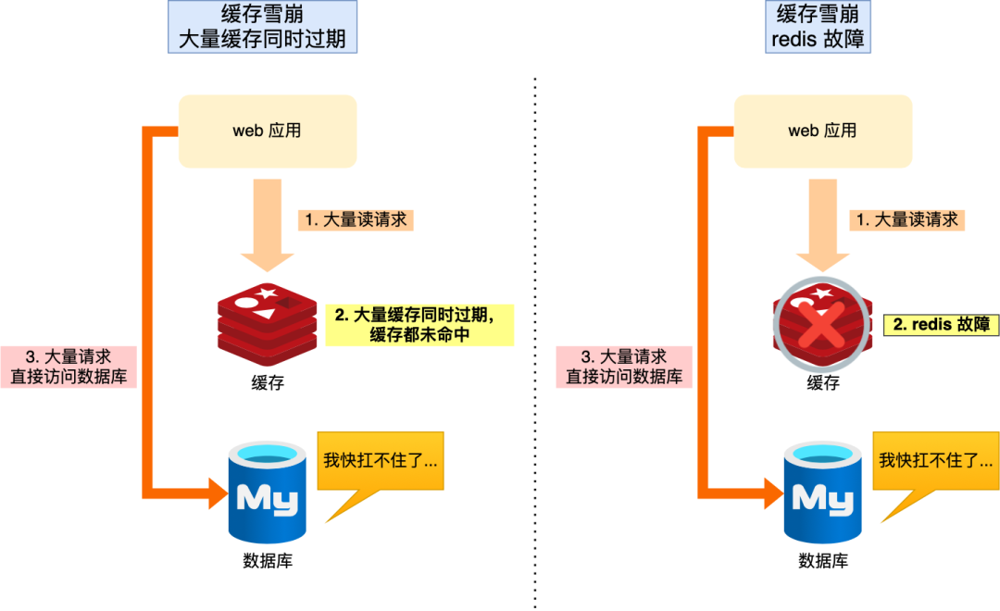
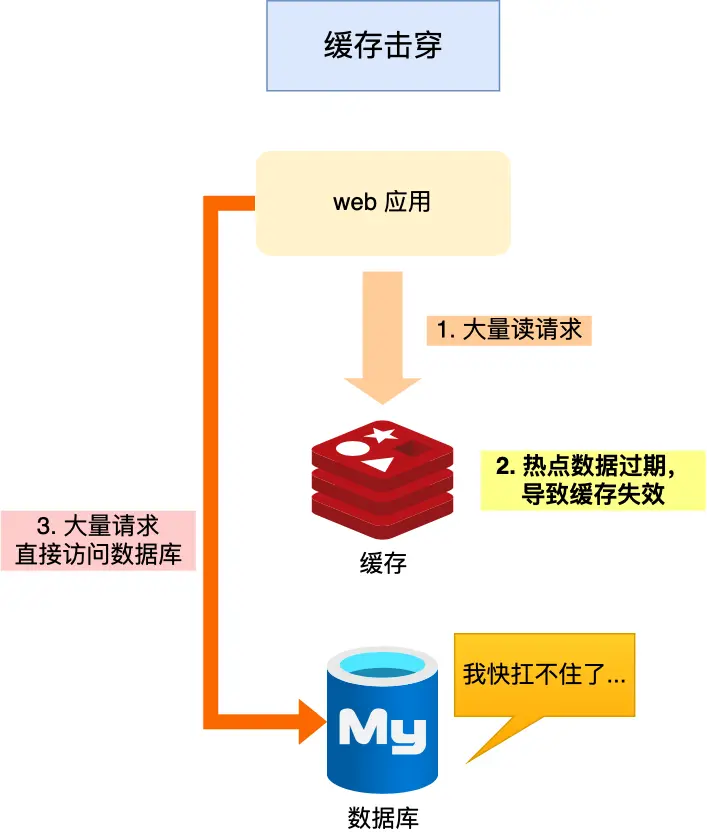

## Redis

### 为什么会用redis
用户的数据一般是存储在磁盘上，磁盘的读写速度是很慢的。用户数量请求量一上来，
磁盘忙不过来，大量请求就处于等待。为了解决这个问题所以引入缓存。这里介绍的是redis缓存。用户请求
先请求redis。如果redis没有该数据，则请求数据库，并将数据存入redis。这样用户请求下次请求该数据就直接从redis获取数据。
从而提高访问速度。

### redis缓存穿透 - 重点在redis出现大量请求
短时间内有大量的请求，这些请求的数据都不在redis中。这个时候就会去请求数据库，但是数据库短时间顶不住这么
大量的请求，及其容易给数据库造成压力或宕机。

**解决方案1：**
- 1、将不存在的key值设置为空,并存入缓存中，下次请求直接从缓存中返回值。
- 2、再请求redis前增加布隆过滤器快速判断数据是否存在。
- 3、请求参数非法校验。

### redis缓存雪崩 -重点在redis大面积过期
业务请求过来，redis缓存的数据大面积过期或者redis宕机了，那么业务请求直接打到数据库中，造成数据库压力增大。

**大量数据同时过期的解决方案：**

- **随机设置过期时间**：再生成过期时间时，随机生成一个时间，比如在60s-120s之间生成一个随机数，然后设置过期时间。
- **互斥锁**：当缓存失效或缓存key为null时，查询数据库的数据前，将redis进行加锁，保证查询此key只有一个请求数据库并构建缓存
等待锁的要么继续等待(设置超时时间)，要么就是直接返回空数据或默认值。
- **后台异步任务更新缓存：** 设置一定时间更新缓存数据，频繁去检测失效的key并及时更新缓存。或者业务读取缓存的数据为空，发
一条数据给消息队列，及时通知消费者更新缓存。

**Redis宕机：**

- redis建立高可靠集群
- redis服务熔断或请求限流

### 缓存击穿 -重点在热点数据失效
热点数据失效，此时大量的请求访问该热点数据。直接访问数据库导致高并发请求容易垮掉。

**解决方案：**

1、增加互斥锁：只允许一个请求去访问数据库，并更新缓存。其他的请求要么指定时间继续等待，要么直接返回空数据或默认值。

2、热点数据不设置过期时间：热点数据统一由后台异步任务去更新。

